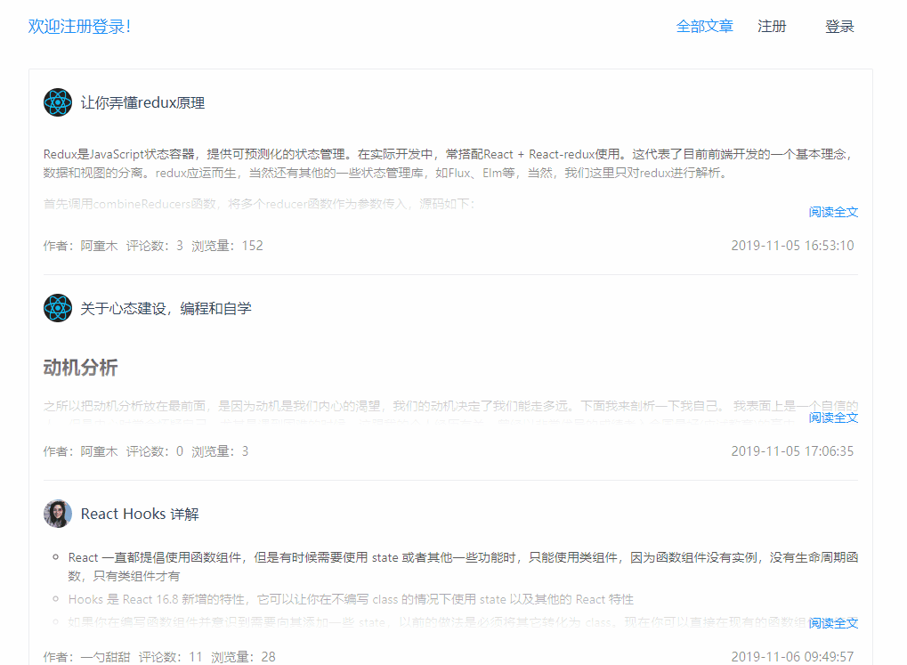
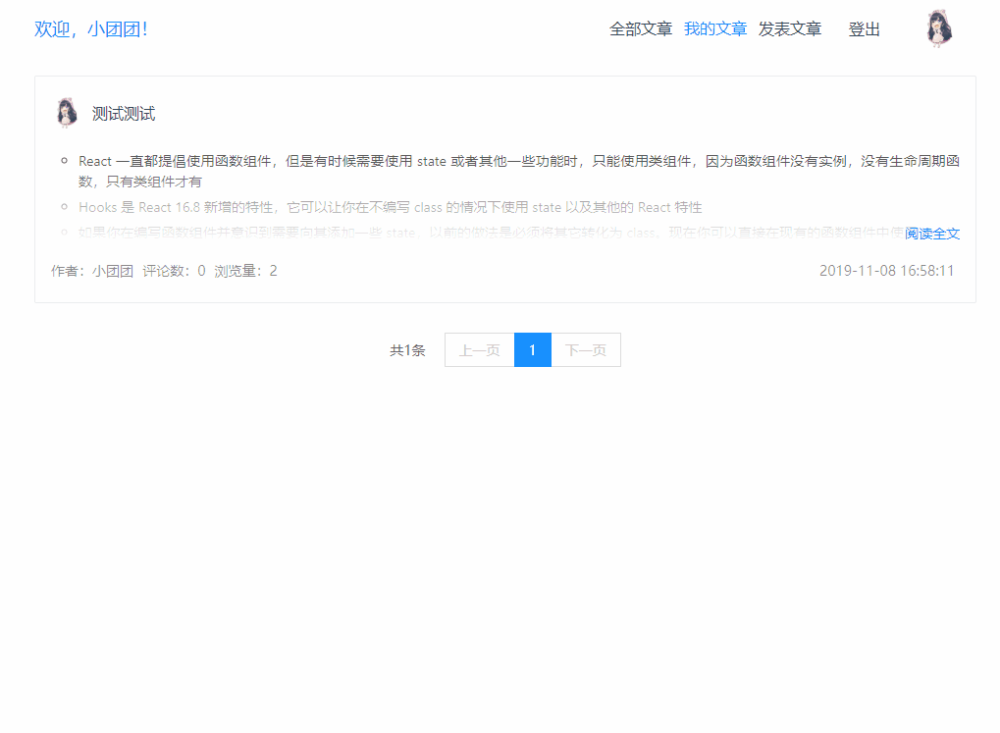
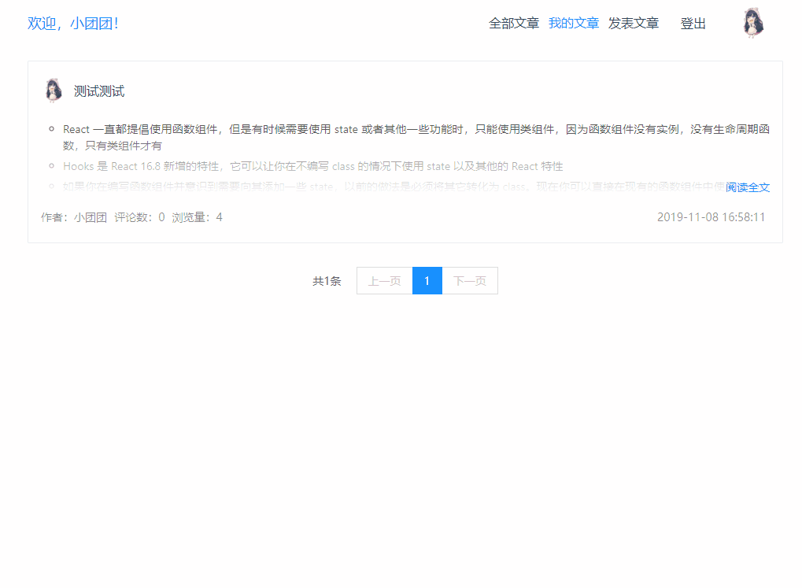

# koa-demo

> [koa 学习笔记](https://github.com/LeoCharles/node-note/blob/master/Koa/Koa%E5%AD%A6%E4%B9%A0%E7%AC%94%E8%AE%B0/index.md)

## 练习 demo

修改 `pageage.json` 中不同的入口文件，启动不同的 demo。

## 实战项目 simple-blog

后端：koa2 + mysql

前端：jQuery

### 项目结构

```sh
├── config            # 配置文件
│   ├── index.js
├── controller        # 控制器文件
│   ├── articles.js   # 文章
│   ├── comments.js   # 评论
│   ├── user.js       # 用户
├── middleware        # 中间件
├── public            # 静态资源
│   ├── css/
│   ├── img/
│   ├── js/
├── utils             # 工具函数
│   ├── index.js
│   ├── mysql.js      # 数据库
├── route             # 路由文件
│   ├── articles.js   # 文章
│   ├── user.js       # 用户
├── views             # 模板文件
└── index.js          # 入口文件
```

### 中间件

+ `koa-bodyparser` 解析表单数据
+ `koa-mysql-session`、`koa-session-minimal` mysql 中存储session 数据
+ `koa-router` 路由中间件
+ `koa-logger` 日志中间件
+ `koa-static` 静态资源加载中间件
+ `koa-views` 模板引擎中间件
+ `ejs` 模板引擎
+ `md5` 加密
+ `dayjs` 时间处理
+ `markdown-it` markdown 语法

### 项目演示

注册登录：



发表文章：


编辑文章：



删除文章：



文章分页：

